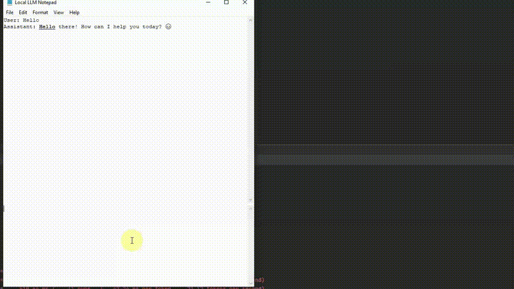

## local-llm-notepad
is an open-source, offline plug-and-play app for running local large-language models. 

**Changes Made:**
- Added saving the path to the last used model and the system prompt
- Updated `requirements.txt`
- Added a mention of the gemma model availability in `src`
- Rewrote all bindings and added the ability to override them via `settings.json`
- Implemented `uv` support in a separate branch
- Updated the `.exe` file in the release
- Added program compilation via `nuitka`
- Updated the `README`
- Uploaded new build files for the `main` and `uv` branches



| File | Link | Notes |
|-------|------|------|
| `local-llm-notepad.exe` | [Download](https://github.com/groknut/local-llm-notepad/releases/tag/v1.0.2) | ~25 MB, contains everything needed to run LLM on Windows computer |
| `gemma-3-1b-it-Q4_K_M.gguf` | [Download](https://huggingface.co/ggml-org/gemma-3-1b-it-GGUF/tree/main) | Fast CPU model (~0.8 GB) we recommend for first-time users. Achieves ~20 tokens/second on an i7-10750H CPU |


## Why you’ll love it

### 🔌 Portable

Drop the one‑file EXE and your .gguf model onto a flash drive; run on any Windows PC without admin rights.

### 🪶 Clean UI

Two‑pane layout: type prompts below, watch token‑streamed answers above—no extra chrome.

### 💾 Save/Load chats

One‑click JSON export keeps conversations with the model portable alongside the EXE.

### ⚡ Llama.cpp inside

CPU‑only by default for max compatibility.

### 🎹 Hot‑keys (Optional)

| Keyboard shortcuts | Action |
|------|------|
| `Shift` + `Return` | send |
| `Ctrl` + `Z` | stop |
| `Ctrl` + `F` | find |
| `Ctrl` + `X` | clear chat history |
| `Ctrl` + `Mouse-Wheel` | zoom |
| `Ctrl` + `P` | edit system prompt |


## Run app from source code
The process is identical to the [`main`](https://github.com/runzhouye/Local_LLM_Notepad) repository (only directory names and library versions in `requirements.txt` differ).

### 1. Clone repository
```bash
git clone -b uv --single-branch https://github.com/groknut/local-llm-notepad.git
cd local-llm-notepad
```

### 2. Synchronizing dependencies and activate `.venv`
```bash
uv sync
.venv\Scripts\activate
cd src
```
### 3. Compile
```bash
nuitka --standalone --enable-plugin=tk-inter --windows-console-mode=disable --onefile --output-filename=local-llm-notepad.exe main.py
```

### 4. Add [`gemma-3-1b-it-Q4_K_M.gguf`](https://huggingface.co/ggml-org/gemma-3-1b-it-GGUF/tree/main) (the default model) and run app
```bash
local-llm-notepad.exe
```
